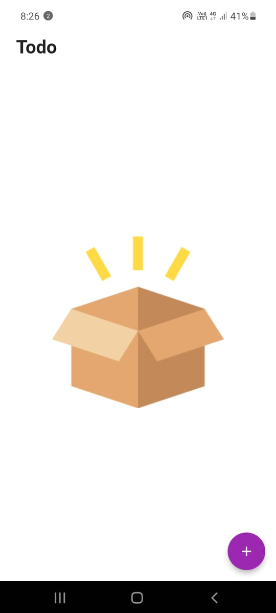
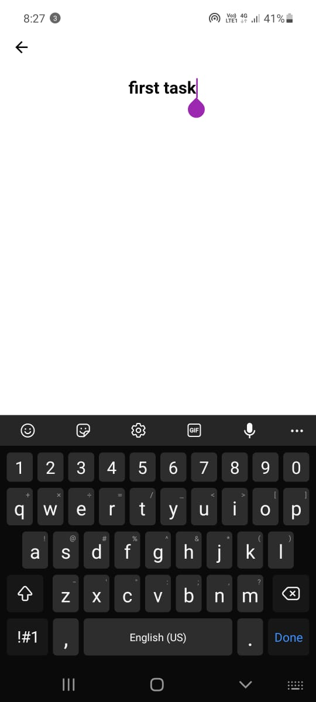
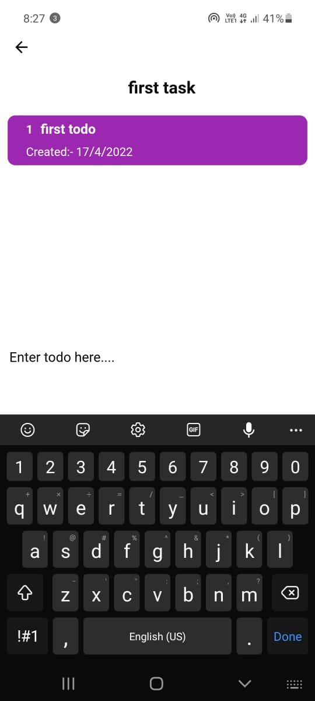
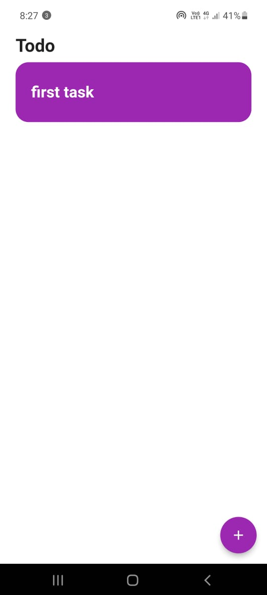
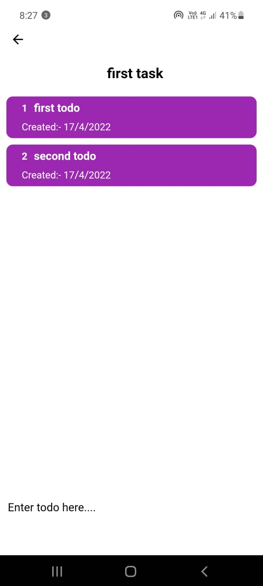
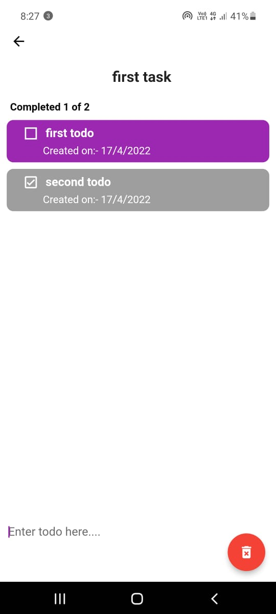
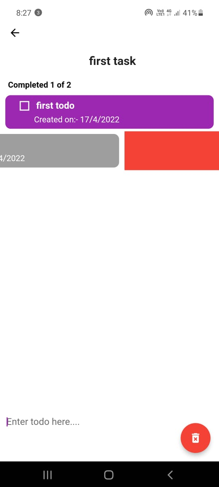

# Todo App

## Created using flutter

### App Description
- Create a task and save in your device.
- You can do CRUD operations like Create,Read,Update and Delete.
- Ui is minimalist with a theme of white and purple color.
- If you want to delete todo just swipe in left or right direction
- Also you can mark as complete task just by tapping it.

### Version 1.0.0
- Same as above App Description.
- using third party library from pub.dev.
- sqflite:- Offline data SQL database for flutter.
- path:- To get the app document directory to store data.

### Screenshots

### Credits
- Flutter sdk
- Adobe Xd
- Flaticon
- Stackoverflow
- Youtube
- Medium
- Dev
- 

